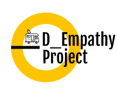

Bienvenido a D_Empathy Project proyecto de periodismo independiente, abierto y colaborativo dedicado a la investigación y al análisis de hechos que afectan al medio ambiente y al desarrollo social sostenido.

Aquí encontrarás los códigos e información de las investigaciones que se  van realizando. Y puedes trabajarlas y compartirlas nuevamente. 

Cualquier nueva investigación que quieras sugerir es bienvenida. Como así también compartir el analisis y brindarlo para que en comunidad lo analicemos. 

D_Empathy Project es una comunidad abierta.  

#### Contacto:

[-D14836?style=for-the-badge&logo=gmail&logoColor=white&labelColor=101010)](mailto:maragdestefanis@gmail.com)

 
 

Saludos. 
Muna. 
